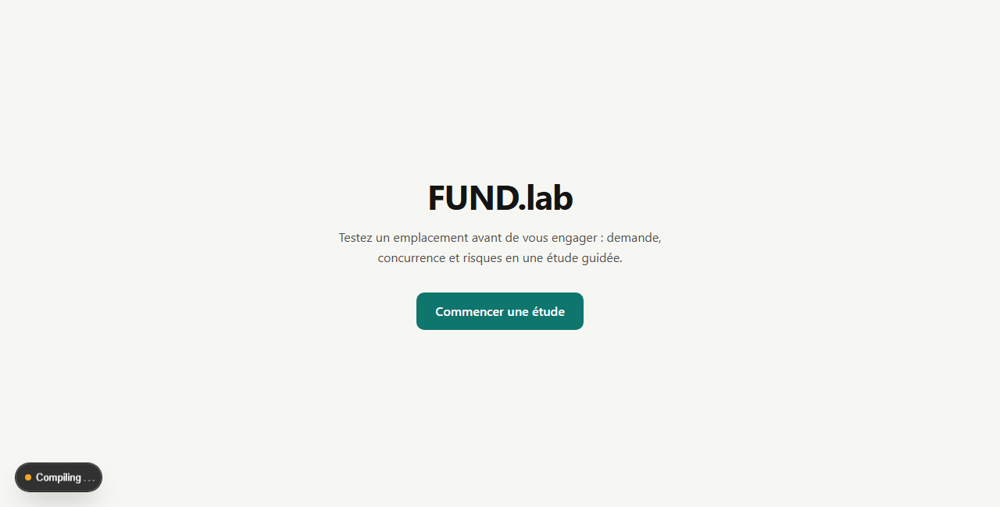
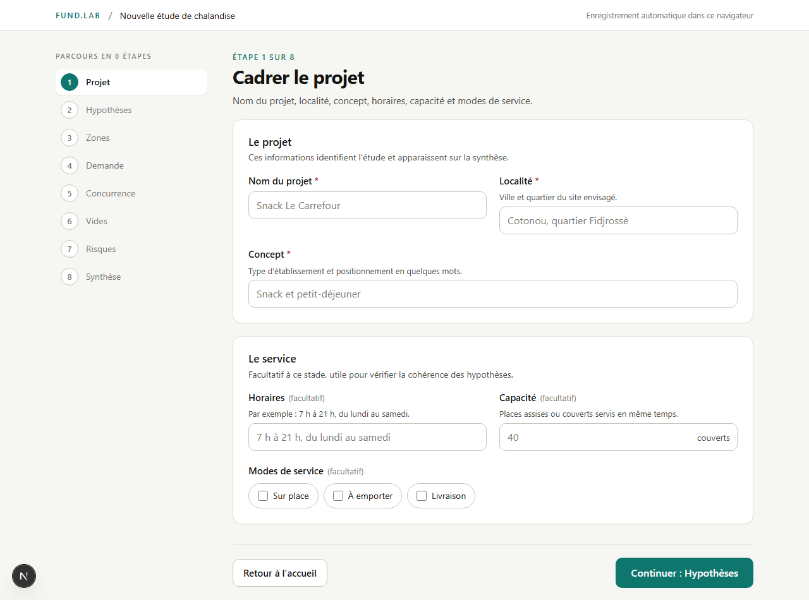
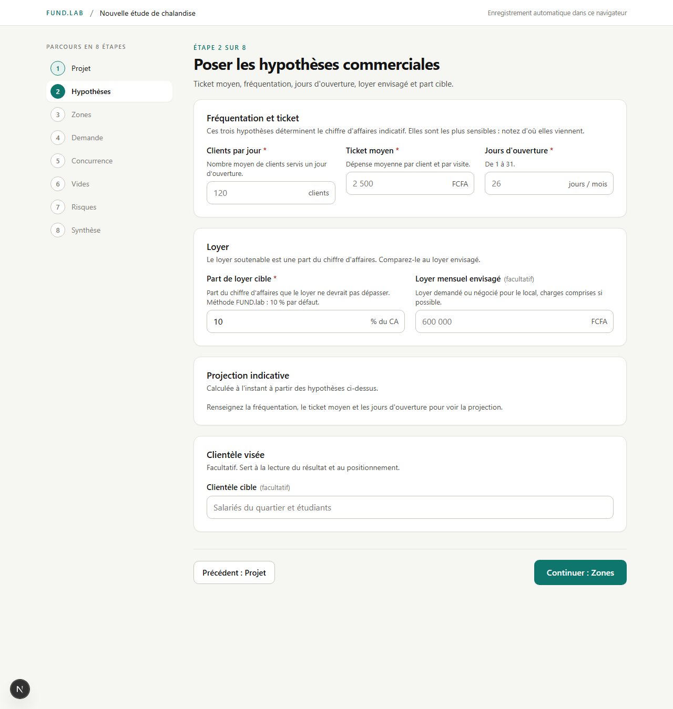
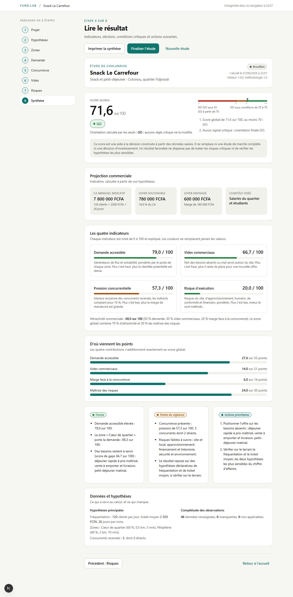
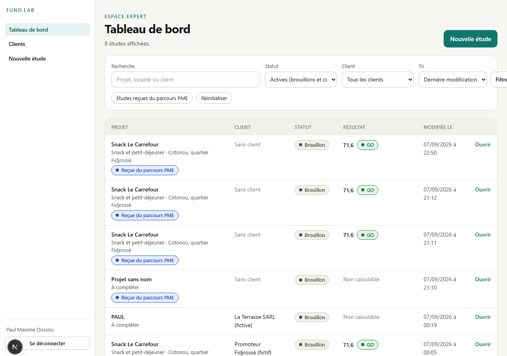
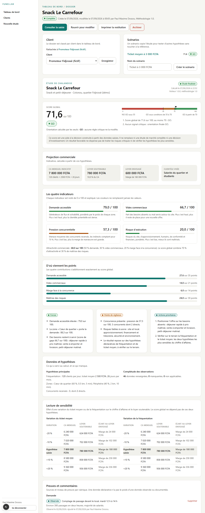

# Guide utilisateur

Livrable L7. Ce guide couvre le parcours PME (sans compte) et l'accès
Expert (authentifié). Les captures montrent l'application réelle, aucune
maquette.

## 1. Le parcours PME, sans compte

Destiné à un promoteur ou dirigeant qui veut tester un emplacement. Aucune
inscription, aucun mot de passe : l'étude est enregistrée automatiquement
dans le navigateur utilisé.

### Démarrer

Depuis la page d'accueil, cliquer sur **Commencer une étude**. Huit étapes
suivent, dans l'ordre. La barre de gauche (repliée en bandeau sur mobile)
montre la progression et permet de revenir en arrière à tout moment, sans
perdre ce qui a été saisi.

### Étape 1, Cadrer le projet

Nom du projet, localité, concept : trois champs obligatoires qui
identifient l'étude et apparaissent sur la synthèse finale. Horaires,
capacité et modes de service sont facultatifs, utiles pour les contrôles
de cohérence des étapes suivantes.

### Étape 2, Poser les hypothèses commerciales

Trois hypothèses déterminent le chiffre d'affaires indicatif : le nombre de
clients par jour, le ticket moyen et les jours d'ouverture par mois. Ce
sont les données les plus sensibles du résultat : le guide rappelle de
noter d'où elles viennent (comptage sur place, déclaration du promoteur).

La part de loyer cible (10 % du chiffre d'affaires par défaut) et le loyer
envisagé permettent de voir immédiatement si le loyer demandé dépasse ce
que l'activité peut soutenir.

### Étape 3, Décrire l'aire de chalandise

Jusqu'à quatre zones, chacune avec un poids (part de la clientèle
attendue). Le total des poids doit faire 100 % pour pouvoir finaliser
l'étude : un bandeau l'indique en temps réel.

### Étape 4, Observer la demande

Pour chaque zone, noter de 0 (absent) à 3 (très fort) sept générateurs de
demande (densité résidentielle, bureaux, commerces, axes de passage,
enseignement, loisirs, solvabilité). Laisser une case vide si l'information
n'est pas connue : une case vide ne compte jamais comme un zéro dans le
calcul.

### Étape 5, Qualifier la concurrence

Ajouter, modifier ou supprimer des concurrents (cinquante au maximum). Pour
chacun : son type d'offre (texte libre), sa relation avec le projet
(directe ou indirecte, qui détermine son poids dans le calcul), et cinq
notes de menace (proximité, affluence, qualité, vitesse, différenciation).
La pression concurrentielle en haut de la page se recalcule à chaque
changement.

### Étape 6, Identifier les vides commerciaux

Pour chaque besoin proposé (petit-déjeuner, déjeuner rapide, cuisine
locale...), indiquer s'il est absent, mal servi ou correctement servi
autour du site, et ajuster son importance si besoin.

### Étape 7, Évaluer les risques

Sept catégories de risques (site, approvisionnement, ressources humaines,
conformité, financement, sécurité, dépendance externe), notées de 0 à 3.
À partir de la note 2, une mesure de traitement et un responsable peuvent
être précisés ; à la note 3, la mesure est requise pour finaliser l'étude.

### Étape 8, Lire le résultat

La synthèse présente, dans l'ordre : le score global et l'orientation
(GO, GO sous conditions, ou NO GO), avec la jauge des seuils et la
justification de la décision ; la projection commerciale (chiffre
d'affaires, loyer soutenable) ; les quatre indicateurs expliqués ; la
décomposition du score en points ; trois forces, trois points de
vigilance et des actions prioritaires ; enfin les hypothèses retenues et
la complétude des données saisies.

Le bouton **Imprimer la synthèse** ouvre l'aperçu d'impression du
navigateur, sans les boutons ni la barre d'étapes. **Finaliser l'étude**
fige le résultat avec la version du moteur utilisée ; l'étude reste
modifiable ensuite via **Reprendre la saisie**.

### Reprendre une étude plus tard

En revenant sur le site depuis le même navigateur, un bandeau propose de
reprendre l'étude enregistrée, à l'étape où elle a été laissée.

## 2. L'accès Expert

Réservé aux consultants FUND.lab. Les comptes sont créés par
l'administrateur du dépôt (voir la documentation technique) : il n'y a pas
d'inscription en libre-service.

### Connexion

Depuis `/connexion`, adresse e-mail et mot de passe. Après cinq échecs sur
un même compte et une même adresse, la connexion est bloquée quinze
minutes.

### Tableau de bord

Liste des études, avec recherche, filtre par statut ou par client, et tri.
Un raccourci affiche uniquement les études reçues du parcours PME (créées
sans compte, à rattacher ensuite à un client si besoin).

### Créer et saisir une étude

**Nouvelle étude** ouvre un formulaire court (nom du projet, client
facultatif), puis les mêmes huit étapes que le parcours PME, avec
sauvegarde automatique sur le serveur au lieu du navigateur.

### Le dossier d'une étude

Au-delà de la synthèse, le dossier Expert ajoute :

- **Rattachement à un client**, modifiable à tout moment.
- **Scénarios** : dupliquer l'étude pour tester d'autres hypothèses sans
  toucher à l'original. La comparaison référence-scénario s'affiche côte à
  côte.
- **Lecture de sensibilité** : effet d'une variation du ticket moyen ou de
  la fréquentation sur le chiffre d'affaires et le loyer soutenable.
- **Preuves** : pour chaque rubrique, une source ou un commentaire avec un
  niveau (déclarative, observée, documentée).
- **Historique des résultats figés**, un par finalisation.
- **Finaliser**, **Rouvrir pour modifier**, **Archiver** (l'étude reste
  consultable, retirée des listes actives) et **Restaurer**.

### Clients

Créer, modifier, archiver un client depuis `/expert/clients`. Chaque fiche
liste ses études.

## Rappel sur le résultat

Le score et l'orientation sont une aide à la décision, construite à partir
des données saisies. Ils ne remplacent ni une étude de marché complète ni
une décision d'investissement. Un résultat favorable ne dispense pas de
traiter les risques critiques ni de vérifier sur le terrain les hypothèses
les plus sensibles.
